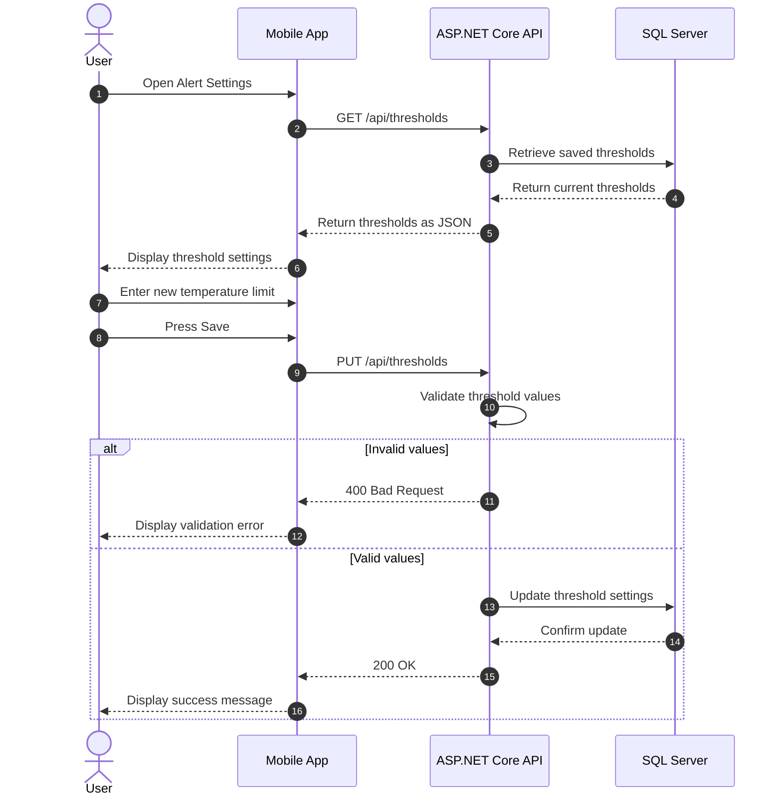
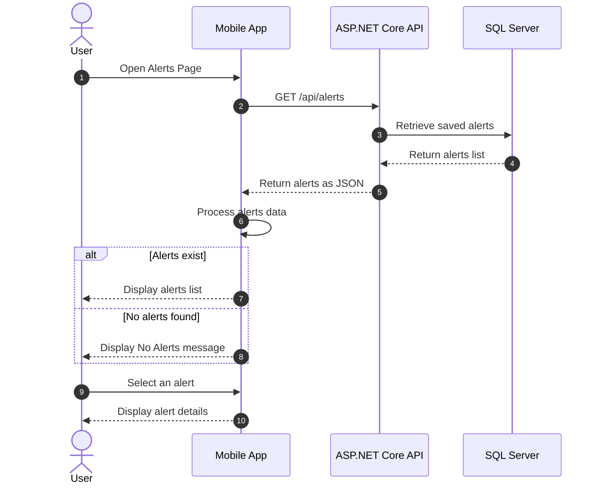

## Sequence Diagrams:

**Seq 5:**

```mermaid
   
sequenceDiagram
    autonumber
    actor U as User
    participant App as Mobile App
    participant API as ASP.NET Core API
    participant DB as SQL Server

    U->>App: Open Alert Settings
    App->>API: GET /api/thresholds
    API->>DB: Retrieve saved thresholds
    DB-->>API: Return current thresholds
    API-->>App: Return thresholds as JSON
    App-->>U: Display threshold settings

    U->>App: Enter new temperature limit
    U->>App: Press Save
    App->>API: PUT /api/thresholds
    API->>API: Validate threshold values

    alt Invalid values
        API-->>App: 400 Bad Request
        App-->>U: Display validation error
    else Valid values
        API->>DB: Update threshold settings
        DB-->>API: Confirm update
        API-->>App: 200 OK
        App-->>U: Display success message
    end

```

**Seq 7:**

```mermaid
   
sequenceDiagram
    autonumber
    actor U as User
    participant App as Mobile App
    participant API as ASP.NET Core API
    participant DB as SQL Server

    U->>App: Open Alerts Page
    App->>API: GET /api/alerts
    API->>DB: Retrieve saved alerts
    DB-->>API: Return alerts list
    API-->>App: Return alerts as JSON
    App->>App: Process alerts data

    alt Alerts exist
        App-->>U: Display alerts list
    else No alerts found
        App-->>U: Display No Alerts message
    end

    U->>App: Select an alert
    App-->>U: Display alert details

```

