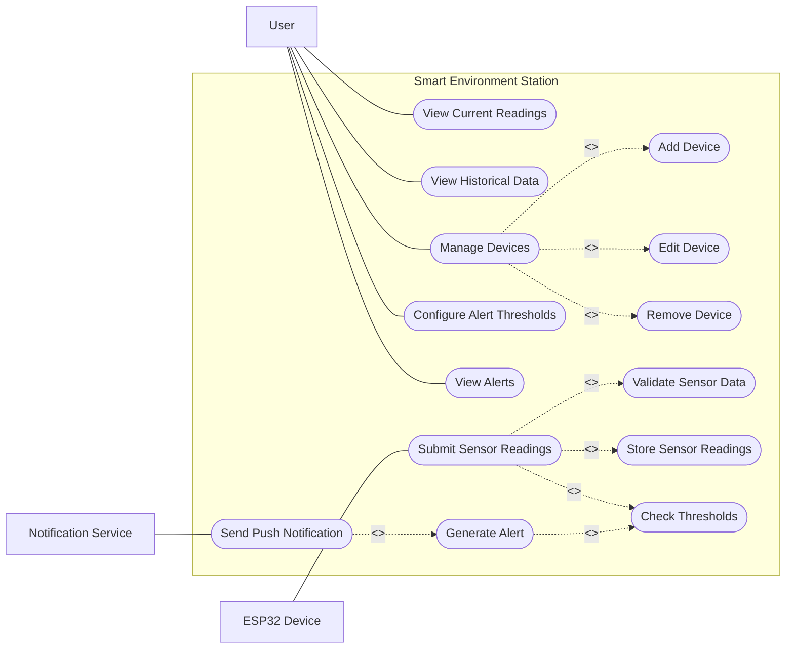

## Smart Environment Station — Use Case Diagram

This diagram shows the actors and use cases of the Smart Environment Station system.

```mermaid
flowchart LR
    User["User"]
    ESP["ESP32 Device"]
    NS["Notification Service"]

    subgraph SYS["Smart Environment Station"]
        direction LR

        UC1(["View Current Readings"])
        UC2(["View Historical Data"])
        UC3(["Manage Devices"])
        UC4(["Add Device"])
        UC5(["Edit Device"])
        UC6(["Remove Device"])
        UC7(["Configure Alert Thresholds"])
        UC8(["View Alerts"])

        UC9(["Submit Sensor Readings"])
        UC10(["Validate Sensor Data"])
        UC11(["Store Sensor Readings"])
        UC12(["Check Thresholds"])
        UC13(["Generate Alert"])
        UC14(["Send Push Notification"])
    end

    User --- UC1
    User --- UC2
    User --- UC3
    User --- UC7
    User --- UC8

    UC3 -.->|"<<include>>"| UC4
    UC3 -.->|"<<include>>"| UC5
    UC3 -.->|"<<include>>"| UC6

    ESP --- UC9
    UC9 -.->|"<<include>>"| UC10
    UC9 -.->|"<<include>>"| UC11
    UC9 -.->|"<<include>>"| UC12

    UC13 -.->|"<<extend>>"| UC12
    UC14 -.->|"<<extend>>"| UC13

    NS --- UC14
```
